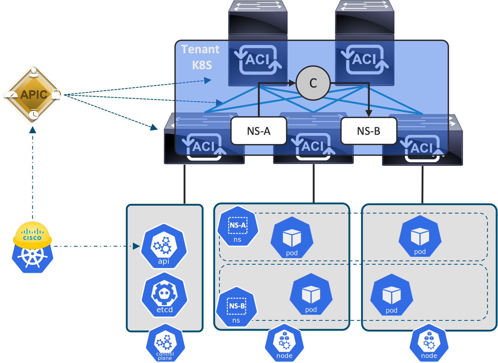
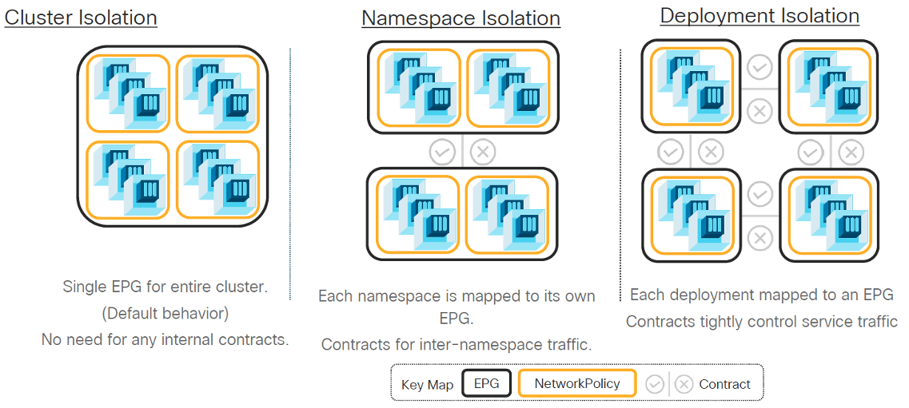
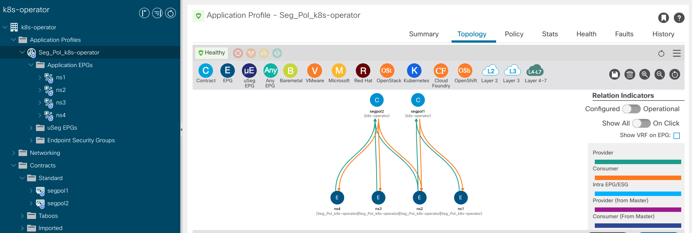

# ACI Kubernetes Operator

[](https://github.com/jgomezve/aci-k8s-operator/actions/workflows/test.yaml)


Simplify the Day-2 operation of a [Kubernetes](https://kubernetes.io/) Cluster running the Cisco [ACI-CNI](https://www.cisco.com/c/en/us/td/docs/switches/datacenter/aci/apic/sw/kb/b_Kubernetes_Integration_with_ACI.html), by automating the configuration the [APIC](https://www.cisco.com/c/en/us/products/cloud-systems-management/application-policy-infrastructure-controller-apic/index.html) using a [Kubernetes Operator](https://kubernetes.io/docs/concepts/extend-kubernetes/operator/). 

This repository contains a Kubernetes Operator used to manage a Custom Resource named `SegmentationPolicy`. The Operator enforces [Namespace](https://kubernetes.io/docs/concepts/overview/working-with-objects/namespaces/) segmentation from the ACI Fabric based on a straightforward Kubernetes Manifest by configuring the required objects (Contracts, Filters, EPGs) on the APIC controller,.

<p align="center">

<br/>

## Overview ACI CNI



The Cisco ACI-CNI takes care of enablinng network connectivity between Pods by provisioning network resources on the worker nodes and on the ACI Fabric. The ACI-CNI extends the ACI iVXLAN Encapsulation used on the ACI Fabric down to the OpenVSwitches running on the worker nodes. This integration gives the ACI Fabric more visibility into the Pod Network, therefore Pods are learned as endpoints of the ACI Fabric.


Even though the ACI-CNI allows Kubernetes Administrators to map Namespaces/Deployments to ACI Endpoint Group, further Policy definition on the ACI Fabric stills requires the creation of ACI Constructs from Network Administrators. This operators aims to automate the provisioning of ACI Constructs by definition a new Kubernetes Resource (Segmentation Policy)

 ## Requirements

* [Cisco APIC](https://www.cisco.com/c/en/us/solutions/data-center-virtualization/application-centric-infrastructure/index.html) >= 5.2.x 
* [Kubernetes](https://kubernetes.io/) >= 1.23
* [ACI-CNI](https://www.cisco.com/c/en/us/td/docs/switches/datacenter/aci/apic/sw/kb/b_Kubernetes_Integration_with_ACI.html)
* [Go](https://golang.org/doc/install) >= 1.17 (Optional)


## Table of Contents

  * [Installation](#installation)
  * [Usage](#usage)

## Installation

This repository has been scaffolded using [Kubebuilder](https://book.kubebuilder.io/introduction.html). Projects created by Kubebuilder contain a [Makefile](https://www.gnu.org/software/make/) that automates the deployment of Kubernetes Resoruces. The make file also leverages [Kustomize](https://kustomize.io/) to dynamically generate Kubernetes manifests

**Your Kubernetes cluster must have already been configured to use the Cisco ACI CNI**

### 1. Clone this repository

      git clone https://github.com/jgomezve/aci-k8s-operator
      cd aci-k8s-operator


### 2. Configure the CRD `SegmentationPolicy`

* Configure the Custom Resource Definition (CRD) `SegmentationPolicy` on the Kubernetes clusters

      make install

```
$ kubectl get crd
NAME                                    CREATED AT
segmentationpolicies.apic.aci.cisco     2022-04-19T15:58:11Z
```

The `install` target configures the manifest located in `config/crd/bases/apic.aci.cisco_segmentationpolicies.yaml`

<details>
  <summary> <code>SegmentationPolicy</code> CRD</summary>
  
  ```yaml
    ---
    apiVersion: apiextensions.k8s.io/v1
    kind: CustomResourceDefinition
    metadata:
      annotations:
        controller-gen.kubebuilder.io/version: v0.8.0
      creationTimestamp: null
      name: segmentationpolicies.apic.aci.cisco
    spec:
      group: apic.aci.cisco
      names:
        kind: SegmentationPolicy
        listKind: SegmentationPolicyList
        plural: segmentationpolicies
        singular: segmentationpolicy
      scope: Namespaced
      versions:
      - name: v1alpha1
        schema:
          openAPIV3Schema:
            description: SegmentationPolicy is the Schema for the segmentationpolicies
              API
            properties:
              apiVersion:
                description: 'APIVersion defines the versioned schema of this representation
                  of an object. Servers should convert recognized schemas to the latest
                  internal value, and may reject unrecognized values. More info: https://git.k8s.io/community/contributors/devel/sig-architecture/api-conventions.md#resources'
                type: string
              kind:
                description: 'Kind is a string value representing the REST resource this
                  object represents. Servers may infer this from the endpoint the client
                  submits requests to. Cannot be updated. In CamelCase. More info: https://git.k8s.io/community/contributors/devel/sig-architecture/api-conventions.md#types-kinds'
                type: string
              metadata:
                type: object
              spec:
                description: SegmentationPolicySpec defines the desired state of SegmentationPolicy
                properties:
                  namespaces:
                    items:
                      type: string
                    type: array
                  rules:
                    items:
                      properties:
                        eth:
                          type: string
                        ip:
                          type: string
                        port:
                          type: integer
                      type: object
                    type: array
                required:
                - namespaces
                - rules
                type: object
              status:
                description: SegmentationPolicyStatus defines the observed state of SegmentationPolicy
                type: object
            type: object
        served: true
        storage: true
        subresources:
          status: {}
    status:
      acceptedNames:
        kind: ""
        plural: ""
      conditions: []
      storedVersions: []

  ```
</details>


### 3. Start the operator
 
The operator requires read/write access privileges the Kubernetes cluster and the APIC controller. During the start-up phase, the Operator discovers APIC configuration parameters from the `ConfigMap` ***aci-containers-config***. This `ConfigMap` is automatically deployed during the installation of the ACI CNI. 

The information discovered  during the start-up pahse includes the username and private key later used by the Operator to configure the APIC. 

> **Note**:  The `ConfigMap` is deployed in the `Namespace` ***aci-containers-system***

#### Option 1: Operator running outside of the K8s Cluster

This is the prefered method for development environments. Make sure Go >=1.17 is installed on the hosting machine

* Set the [kubeconfig file](https://kubernetes.io/docs/concepts/configuration/organize-cluster-access-kubeconfig/) on the hosting machine to grant the Operator access to the cluster

      export KUBECONFIG=<kubeconfigfile.yaml>

* Compile the code and execute the binary file 

      make run

```
1.6523912324578347e+09	INFO	setup	ACI CNI configuration discovered for tenant k8s-rke-aci-cni-pod-4 in APIC controller 172.20.91.9
1.6523912325494506e+09	INFO	setup	starting manager
1.6523912325497773e+09	INFO	controller.segmentationpolicy	Starting EventSource	{"reconciler group": "apic.aci.cisco", "reconciler kind": "SegmentationPolicy", "source": "kind source: *v1alpha1.SegmentationPolicy"}
1.6523912325498345e+09	INFO	controller.segmentationpolicy	Starting EventSource	{"reconciler group": "apic.aci.cisco", "reconciler kind": "SegmentationPolicy", "source": "kind source: *v1.Namespace"}
1.6523912325498483e+09	INFO	controller.segmentationpolicy	Starting Controller	{"reconciler group": "apic.aci.cisco", "reconciler kind": "SegmentationPolicy"}
1.6523912326504896e+09	INFO	controller.segmentationpolicy	Starting workers	{"reconciler group": "apic.aci.cisco", "reconciler kind": "SegmentationPolicy", "worker count": 1}
```

#### Option 2: Operator running inside of the K8s Cluster as a Pod
      
This is the preferred method for production environments. The operator runs as a containerized application inside a `Pod`. A `ClusterRole` and corresponding `ClusterRoleBinding` objects are configured to ensure that the Pod has the required permissions to read/write the Kubernetes API. Based on best-practices, a `Deployment`, configured in a dedicated `Namespace`, manages the `Pod` which hosts the Operator application


Connectivity from the Operator's Pod to the APIC controller can satisfied by any of the following options:

  - `SnatPolicy`: This new CRD available in the ACI CNI allows Pods communicate outside of the cluster using SNAT
  - `LoadBalancer`: This Service Type exposes Pods in the cluster over a know IP address. It also enables the exposed Pods to reach external networks


*  Deploy the Operator on the Kubernetes Cluster

      make deploy 

```
namespace/aci-operator-system created
customresourcedefinition.apiextensions.k8s.io/segmentationpolicies.apic.aci.cisco created
serviceaccount/aci-operator-controller-manager created
role.rbac.authorization.k8s.io/aci-operator-leader-election-role created
clusterrole.rbac.authorization.k8s.io/aci-operator-manager-role created
clusterrole.rbac.authorization.k8s.io/aci-operator-metrics-reader created
clusterrole.rbac.authorization.k8s.io/aci-operator-proxy-role created
rolebinding.rbac.authorization.k8s.io/aci-operator-leader-election-rolebinding created
clusterrolebinding.rbac.authorization.k8s.io/aci-operator-manager-rolebinding created
clusterrolebinding.rbac.authorization.k8s.io/aci-operator-proxy-rolebinding created
configmap/aci-operator-manager-config created
service/aci-operator-controller-manager-metrics-service created
deployment.apps/aci-operator-controller-manager created
```

*  Check the Controler status

```
$ kubectl get pod -n aci-operator-system
NAME                                              READY   STATUS    RESTARTS   AGE
aci-operator-controller-manager-55d9777c9-89vh4   2/2     Running   0          14m
```

## Usage 


* Create four namespaces

      kubectl create ns <ns_name>

```
NAME                    STATUS   AGE
aci-containers-system   Active   145d
cattle-system           Active   145d
default                 Active   145d
fleet-system            Active   145d
ingress-nginx           Active   145d
kube-node-lease         Active   145d
kube-public             Active   145d
kube-system             Active   145d
ns1                     Active   11s
ns2                     Active   8s
ns3                     Active   5s
ns4                     Active   3s

```

* Configure a two `SegmentationPolicy` Custom Resources (CR) 

*apic_v1alpha1_segmentationpolicy.yaml*
```yaml
apiVersion: apic.aci.cisco/v1alpha1
kind: SegmentationPolicy
metadata:
  name: segpol1
spec:
  tenant: k8s-operator
  namespaces:
    - ns1
    - ns2
  rules:
    - eth: arp
    - eth: ip
      ip: udp
      port: 53
---
apiVersion: apic.aci.cisco/v1alpha1
kind: SegmentationPolicy
metadata:
  name: segpol2
spec:
  tenant: k8s-operator
  namespaces:
    - ns2
    - ns3
    - ns4
  rules:
    - eth: ip
      ip: tcp
      port: 80 
```

      kubectl apply -f apic_v1alpha1_segmentationpolicy.yaml

```
$ kubectl get segmentationpolicies.apic.aci.cisco
NAME      AGE
segpol1   22s
segpol2   22s
```
> **_NOTE:_** Examples can be found under `config/samples/apic_v1alpha1_segmentationpolicy.yaml`



## More Information
Build using [Kubebuilder](https://book.kubebuilder.io/introduction.html)
