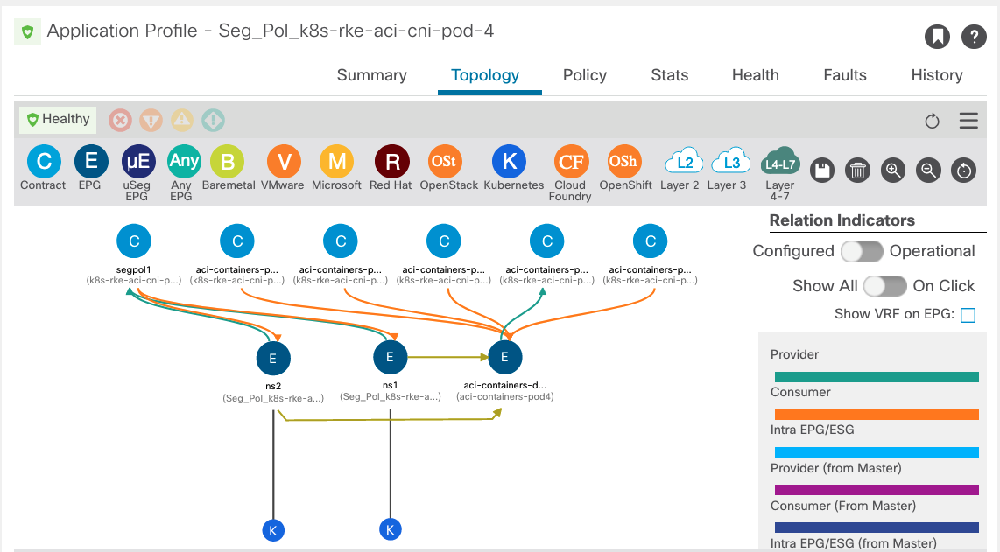

# A Kubernetes Operator to Manage Cisco ACI Policies

[](https://github.com/jgomezve/aci-k8s-operator/actions/workflows/test.yaml)


[](https://developer.cisco.com/codeexchange/github/repo/jgomezve/aci-k8s-operator)

Simplify the Day-2 operation of a [Kubernetes](https://kubernetes.io/) Cluster running the Cisco [ACI Container Network Interface (CNI)](https://www.cisco.com/c/dam/en/us/solutions/collateral/data-center-virtualization/application-centric-infrastructure/solution-overview-c22-739493.pdf), by automating the configuration of the [APIC](https://www.cisco.com/c/en/us/products/cloud-systems-management/application-policy-infrastructure-controller-apic/index.html) using a [Kubernetes Operator](https://kubernetes.io/docs/concepts/extend-kubernetes/operator/).  This repository contains a Kubernetes Operator used to manage a Custom Resource named `SegmentationPolicy`. The Operator enforces [Namespace](https://kubernetes.io/docs/concepts/overview/working-with-objects/namespaces/) segmentation, based on a straightforward and user-friendly Kubernetes manifest, through the configuration of the required objects (Contracts, Filters, EPGs) on the APIC controller.


## ACI CNI Unified Networking

The ACI-CNI is an overlay network plugin that enables a smooth integration between Kubernetes nodes and the ACI Fabric. The plugin makes possible distributed routing and switching with VXLAN overlays on the Fabric and on the Kubernetes nodes. By using the ACI CNI, Pods running inside the Kubernetes cluster become endpoints of the ACI Fabric. As a result, the same level of segmentation and policing applied to Bare-metal servers and virtual machines can also be applied to the Pods.

<p align="center">

<br/>

Kubernetes administrators can map Deployments and Namespaces to EPGs, which are in turn managed by Network administrators to apply rules with the ACI Policy Model. This Operator eases the collaboration between Network and Kubernetes administrators through the automation of the configuration of ACI Policies based on the specification of a new Custom Resource, the `SegmentationPolicy`.

## Table of Contents

  * [Requirements](#requirements)
  * [Installation](#installation)
  * [Usage](#usage)

 ## Requirements

* [Cisco APIC](https://www.cisco.com/c/en/us/solutions/data-center-virtualization/application-centric-infrastructure/index.html) >= 5.2.x
* [Kubernetes](https://kubernetes.io/) >= 1.23
* [ACI-CNI](https://www.cisco.com/c/en/us/td/docs/switches/datacenter/aci/apic/sw/kb/b_Kubernetes_Integration_with_ACI.html)
* [Go](https://golang.org/doc/install) >= 1.17 (Optional)
* [Make](https://www.gnu.org/software/make/)
* [Kustomize](https://kustomize.io/)  


## Installation

This repository has been scaffolded using [Kubebuilder](https://book.kubebuilder.io/introduction.html). Projects created by Kubebuilder contain a Makefile that eases the installation and testing of the Kubernetes Operator. The Makefile also leverages Kustomize to dynamically generate Kubernetes manifests.

> **Your Kubernetes cluster must have already been configured to use the Cisco ACI CNI**

### 1. Clone this repository

```
      $ git clone https://github.com/jgomezve/aci-k8s-operator
      $ cd aci-k8s-operator
```


### 2. Configure the CRD `SegmentationPolicy`

* Configure the Custom Resource Definition (CRD) `SegmentationPolicy` on the Kubernetes clusters

```
      $ make install
      customresourcedefinition.apiextensions.k8s.io/segmentationpolicies.apic.aci.cisco configured
```
```
      $ kubectl get crd
      NAME                                    CREATED AT
      segmentationpolicies.apic.aci.cisco     2022-04-19T15:58:11Z
```

* Alternatively you could apply the manifest directly

```
      $ kubectl -f apply config/crd/bases/apic.aci.cisco_segmentationpolicies.yaml
      customresourcedefinition.apiextensions.k8s.io/segmentationpolicies.apic.aci.cisco configured
```

<details>
  <summary><code>config/crd/bases/apic.aci.cisco_segmentationpolicies.yaml</code></summary>
  
  ```yaml
    ---
    apiVersion: apiextensions.k8s.io/v1
    kind: CustomResourceDefinition
    metadata:
      annotations:
        controller-gen.kubebuilder.io/version: v0.8.0
      creationTimestamp: null
      name: segmentationpolicies.apic.aci.cisco
    spec:
      group: apic.aci.cisco
      names:
        kind: SegmentationPolicy
        listKind: SegmentationPolicyList
        plural: segmentationpolicies
        shortNames:
        - segpol
        singular: segmentationpolicy
      scope: Namespaced
      versions:
      - name: v1alpha1
        schema:
          openAPIV3Schema:
            description: SegmentationPolicy is the Schema for the segmentationpolicies
              API
            properties:
              apiVersion:
                description: 'APIVersion defines the versioned schema of this representation
                  of an object. Servers should convert recognized schemas to the latest
                  internal value, and may reject unrecognized values. More info: https://git.k8s.io/community/contributors/devel/sig-architecture/api-conventions.md#resources'
                type: string
              kind:
                description: 'Kind is a string value representing the REST resource this
                  object represents. Servers may infer this from the endpoint the client
                  submits requests to. Cannot be updated. In CamelCase. More info: https://git.k8s.io/community/contributors/devel/sig-architecture/api-conventions.md#types-kinds'
                type: string
              metadata:
                type: object
              spec:
                description: SegmentationPolicySpec defines the desired state of SegmentationPolicy
                properties:
                  namespaces:
                    items:
                      type: string
                    type: array
                  rules:
                    items:
                      properties:
                        eth:
                          type: string
                        ip:
                          type: string
                        port:
                          type: integer
                      type: object
                    type: array
                required:
                - namespaces
                - rules
                type: object
              status:
                description: SegmentationPolicyStatus defines the observed state of SegmentationPolicy
                type: object
            type: object
        served: true
        storage: true
        subresources:
          status: {}
    status:
      acceptedNames:
        kind: ""
        plural: ""
      conditions: []
      storedVersions: []
  ```
</details>


### 3. Start the operator
 
The operator requires read/write access privileges to the Kubernetes cluster and the APIC controller. During the start-up phase, the Operator discovers the APIC configuration parameters from the `ConfigMap` ***aci-containers-config***. This `ConfigMap` is automatically deployed during the installation of the ACI CNI. 

APIC's username and private key, which are used by the  Operator, are discovered during the start-up phase.


> **Note**:  The `ConfigMap` ***aci-containers-config*** is deployed in the `Namespace` ***aci-containers-system***

#### Option 1: Operator running outside of the K8s Cluster

This is the preferred method for development environments. Make sure Go >=1.17 is installed on the machine running the Kubernetes Operator

* Set the [kubeconfig file](https://kubernetes.io/docs/concepts/configuration/organize-cluster-access-kubeconfig/) on the hosting machine to grant the Operator access to the Kubernetes cluster

```
      $ export KUBECONFIG=<kubeconfigfile.yaml>
```

* Compile the code and execute the binary file 

```
      $ make run

```

* Alternatively you could excute Go commands directly

```
      $ go run ./main.go

1.6523912324578347e+09	INFO	setup	ACI CNI configuration discovered for tenant k8s-rke-aci-cni-pod-4 in APIC controller 172.20.91.9
1.6523912325494506e+09	INFO	setup	starting manager
1.6523912325497773e+09	INFO	controller.segmentationpolicy	Starting EventSource	{"reconciler group": "apic.aci.cisco", "reconciler kind": "SegmentationPolicy", "source": "kind source: *v1alpha1.SegmentationPolicy"}
1.6523912325498345e+09	INFO	controller.segmentationpolicy	Starting EventSource	{"reconciler group": "apic.aci.cisco", "reconciler kind": "SegmentationPolicy", "source": "kind source: *v1.Namespace"}
1.6523912325498483e+09	INFO	controller.segmentationpolicy	Starting Controller	{"reconciler group": "apic.aci.cisco", "reconciler kind": "SegmentationPolicy"}
1.6523912326504896e+09	INFO	controller.segmentationpolicy	Starting workers	{"reconciler group": "apic.aci.cisco", "reconciler kind": "SegmentationPolicy", "worker count": 1}
```

#### Option 2: Operator running inside of the K8s Cluster as a Pod
      
This is the preferred method for production environments. The operator runs as a containerized application inside a `Pod`. `ClusterRole` and corresponding `ClusterRoleBinding` with `ServiceAccount` objects must be configured to ensure that the Pod has the required permissions to read/write the Kubernetes API. Based on best-practices, a `Deployment`, configured in a dedicated `Namespace`, manages the `Pod` which hosts the Operator application


Connectivity from the Operator's Pod to the APIC controller can satisfied by any of the following options:

  1. `SnatPolicy`: This new CRD, available in the ACI-CNI, allows Pods to communicate outside of the cluster using SNAT
  2. `LoadBalancer`: This Service Type exposes Pods in the cluster over a known IP address. It also enables the exposed Pods to reach external networks


*  Deploy the Operator on the Kubernetes Cluster

```
      $ make deploy 

      namespace/aci-k8s-operator-system created
      customresourcedefinition.apiextensions.k8s.io/segmentationpolicies.apic.aci.cisco created
      serviceaccount/aci-k8s-operator-controller-manager created
      role.rbac.authorization.k8s.io/aci-k8s-operator-leader-election-role created
      clusterrole.rbac.authorization.k8s.io/aci-k8s-operator-manager-role created
      clusterrole.rbac.authorization.k8s.io/aci-k8s-operator-metrics-reader created
      clusterrole.rbac.authorization.k8s.io/aci-k8s-operator-proxy-role created
      rolebinding.rbac.authorization.k8s.io/aci-k8s-operator-leader-election-rolebinding created
      clusterrolebinding.rbac.authorization.k8s.io/aci-k8s-operator-manager-rolebinding created
      clusterrolebinding.rbac.authorization.k8s.io/aci-k8s-operator-proxy-rolebinding created
      configmap/aci-k8s-operator-manager-config created
      service/aci-k8s-operator-controller-manager-metrics-service created
      deployment.apps/aci-k8s-operator-controller-manager created
```

* Alternatively you could apply the manifest `config/samples/controller_lightweight.yaml` directly. This manifest creates the minimum resources required to run the operator inside the Kubernetes Cluster:
  * A `Namespace` which contains the  namespace-scoped resources
  * A `ServiceAccount` which grants the Operator access tot he Kubernetes API Server
  * A `ClusterRole` listing the resources and actions the Operator has access to
  * A `ClusterRoleBinding` which binds the `Role` with the `ServiceAccount`
  * A `Deployment` of one replica hosting the Operator code.

```
      $ kubectl apply  -f config/samples/controller_lightweight.yaml
      namespace/aci-k8s-operator-system created
      deployment.apps/controller-manager created
      serviceaccount/controller-manager created
      clusterrole.rbac.authorization.k8s.io/manager-role created
      clusterrolebinding.rbac.authorization.k8s.io/manager-rolebinding created
```

*  Check the Controler status

```
      $ kubectl get pod -n aci-k8s-operator-system
      NAME                                              READY   STATUS    RESTARTS   AGE
      aci-k8s-operator-controller-manager-55d9777c9-89vh4   2/2     Running   0          14m
```

## Usage 

The following example restricts communication between `Namepaces` ***ns1*** and ***ns2*** to only HTTPS. A Custom Resource of type `SegmentationPolicy` is created. It specifies the name of the Namespaces and the rules under `spec.namespaces[]` and  `spec.rules[]` respectively

* Create the `Namespaces`
```
      $ kubectl create namespace ns1
      $ kubectl create namespace ns2
      namespace/ns1 created
      namespace/ns2 created
```
```
      $ kubectl get namespace
      NAME                    STATUS   AGE
      ns1                     Active   11s
      ns2                     Active   8s

```

* Create a `SegmentationPolicy` Custom Resources (CR) 

***segmentationpolicy.yaml***
```yaml
apiVersion: apic.aci.cisco/v1alpha1
kind: SegmentationPolicy
metadata:
  name: segpol1
spec:
  namespaces:
    - ns1
    - ns2
  rules:
    - eth: ip
      ip: tcp
      port: 443
```

      $ kubectl apply -f segmentationpolicy.yaml
      segmentationpolicy.apic.aci.cisco/segpol1 created

```
      $ kubectl get segmentationpolicies
      NAME      NAMESPACES   RULES        STATE      AGE
      segpol1   ns1, ns2     ip-tcp-443   Enforced   20s
```

* The Kubernetes Operator configures the following Objects/Relationship on the APIC Controller
  1. **Filter** per rule defined in the `SegmentationPolicy` CR. The name of the Filters is built based on the information from the manifest as follows **<metadata.name><rule.eth><rule.ip><rule.port>**
  2. **Contract** and **Subject** with the name of the `SegmentationPolicy`. The subject includes all the filters mentioned in point ***(i)***  
  4. An **Application Profile** named **Seg_Pol_<tenant_name>**
  5. An **EPG** per Namespace defined in the `SegmentationPolicy` CR. The names of the EPGs are the same names of the `Namespaces` [*]. The following properties are configured under the EPG:
    * The Bridge Domain is set to the one assigned to the Pod Network
    * The VMM Domain of type Kubernetes used by the CNI is assigned
    * The Contracts mentioned in point ***(ii)*** are consumed and assigned
    * The ACI-CNI "default" EPG is set as the Master EPG





> **Note**:  [*] If a `Namespace` is defined in the `SegmentationPolicy` but does not exist in the Kubernetes Cluster, the EPG is not created. Likewise, if a `Namespace` listed in a `SegmentationPolicy` is deleted, the Operator reacts and deletes the corresponding EPG.
