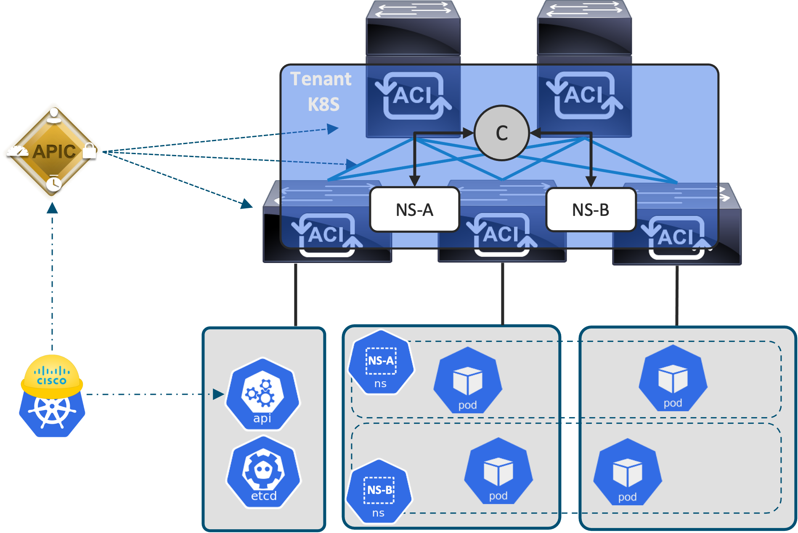

 A Kubernetes Operator to Manage Cisco ACI Policies
=====================================================

Simplify the Day-2 operation of a [Kubernetes](https://kubernetes.io/) Cluster running the Cisco [ACI Container Network Interface (CNI)](https://www.cisco.com/c/dam/en/us/solutions/collateral/data-center-virtualization/application-centric-infrastructure/solution-overview-c22-739493.pdf), by automating the configuration of the [APIC](https://www.cisco.com/c/en/us/products/cloud-systems-management/application-policy-infrastructure-controller-apic/index.html) using a [Kubernetes Operator](https://kubernetes.io/docs/concepts/extend-kubernetes/operator/).  This repository contains a Kubernetes Operator used to manage a Custom Resource named `SegmentationPolicy`. The Operator enforces [Namespace](https://kubernetes.io/docs/concepts/overview/working-with-objects/namespaces/) segmentation, based on a straightforward and user-friendly Kubernetes manifest, through the configuration of the required objects (Contracts, Filters, EPGs) on the APIC controller.

 

## Related Sandbox 
* [ACI Simulator 5.2 ](https://devnetsandbox.cisco.com/RM/Diagram/Index/4eaa9878-3e74-4105-b26a-bd83eeaa6cd9?diagramType=Topology)
* [ACI Simulator AlwaysOn](https://devnetsandbox.cisco.com/RM/Diagram/Index/18a514e8-21d4-4c29-96b2-e3c16b1ee62e?diagramType=Topology)

## Links to DevNet Learning Labs
* [ACI Programmability](https://developer.cisco.com/learning/tracks/aci-programmability)